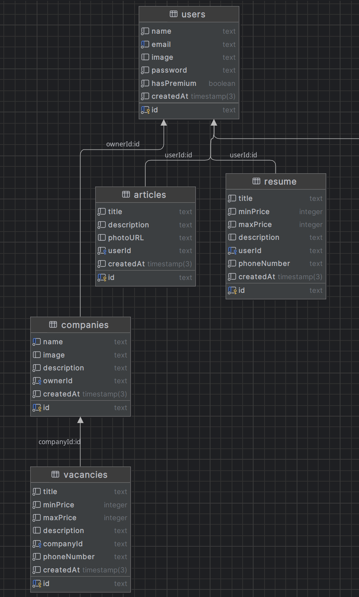

## Сайт с вакансиями
## Шиптенко Владислав Дмитриевич, M3301

Ссылка на сайт: http://158.160.144.181:5000

## Описание доменной области

Основная цель системы — предоставить пользователям возможность создавать и просматривать вакансии, статьи и резюме.

## Выделенные сущности

1. Users – Предоставляет информацию о пользователях.​
Атрибуты: имя пользователя (name), адрес электронной почты (email),
аватар пользователя (image), пароль (password), наличие премиума
(hasPremium), дата создания пользователя (createdAt).
2. Articles – Предоставляет информацию о статьях.​
Атрибуты: название (title), содержание статьи (description), шапка
статьи (photoURL), связанный пользователь (userId), дата создания
статьи (createdAt).
3. Resume – Предоставляет информацию о резюме.​
Атрибуты: название (title), нижняя граница зарплаты (minPrice),
верхняя граница зарплаты (maxPrice), описание резюме (description),
связанный пользователь (userId), номер телефона (phoneNumber), дата
создания резюме (createdAt).
4. Companies – Предоставляет информацию о компаниях.​
Атрибуты: название (name), логотип компании (image), описание
компании (description), владелец компании (ownerId), дата создания
компании (createdAt).
5. Vacancies – Предоставляет информацию о вакансиях.​
Атрибуты: название (title), нижняя граница зарплаты (minPrice),
верхняя граница зарплаты (maxPrice), описание вакансии (description),
связанная компания (companyId), номер телефона (phoneNumber), дата
создания вакансии (createdAt).